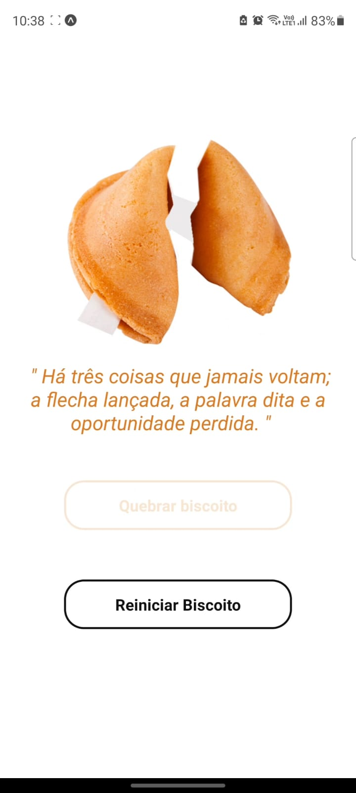

<h1>Biscoito da sorte</h1>

<!-- LINKS -->

 
 <h2> Sumário</h2>
 
 <a href="#fotos">Fotos</a> - 
  <a href="#sobre">Sobre o Projeto</a> - 
  <a href="#tec">Tecnologias</a>

 

<!-- FOTOS -->

    <h2> 📸 Fotos </h2>
        
       
  

<!-- SOBRE -->

    <h2> 📝 Sobre o Projeto </h2> 
    
 Esse Projeto foi feito no intuito de imitar um  <strong>biscoito da sorte.</strong> Clicando em "abrir biscoito" uma frase aparece na tela, e em "reinicar biscoito", ele se fecha para poder ser aberto novamente

 

<!-- TECNOLOGIAS -->

<h2> 🖥️ Tecnologias</h2>
    
 ✔️JavaScript

    
 ✔️ React Native

